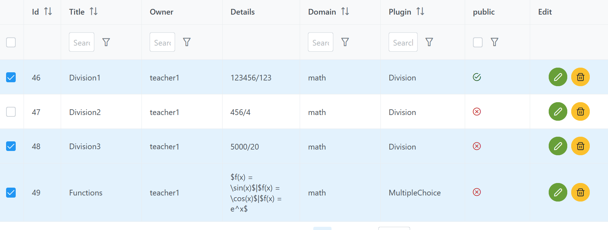

# User guide

## User

In order to use Doatask, one needs a user. Either one registers directly in the
system and can then log in in the future, or the login is done via an LTI
platform such as Moodle, which then forwards the user into Doatask.

There are three types (roles) of users:

* student
* teacher
* admin

When logging in through an LTI platform like Moodle, the role (student or
teacher) is taken from the platform. If you register directly in Doatask, you
have the student role by default.

Only an admin user can change the role of a user.

## Domains

New domains are created by an admin user or created on the fly when importing tasks.

## Task

All tasks have properties that are always present.

If you create a new task you have first to select the plugin. A plugin offers
certain plugin specific task types. Then you fill in the values for the
following properties:

|Field name|Value|
|----------|-----|
|Domain|knowledge domain|
|Title|title of the task|
|Tags|tags that can be used to classify tasks|
|public|if checked the task is visible for all users|
|Description|description of the task|
|plugin specific fields|see the documentation of the plugin|

Then you can save the task.

In some plugins (e.g. multiple choice) the text of the description can be
[markdown-it](https://markdown-it.github.io/). You can also use LaTeX via
[KaTeX](https://katex.org/).

On the left you enter a text in Markdown format with optional LaTeX formulas and on the right you see the rendering of this text.

The task is presented to the student as follows:

## Assignment

When creating a new assignment, you must first fill in the following fields:

|Field name|Value|
|----------|-----|
|Title|title of the assignment|
|Description|description of the assignment|
|public|if checked the assignment is visible for all users|
|Due date|the date when the assignment is due|

Then you can save the assignment. The assignment is created but does not have
any tasks yet. The next step is to add tasks to the assignment. The tasks can be
selected from all the tasks that the teacher has created or that are public.

The order of tasks can be changed by dragging a task by its hamburger menu
(three horizontal lines) to the desired position.

Within an assignment, each task has a weight and an optional time limit.

The default weight is 10. You can change it by clicking on the field and
entering a new value.

The optional time limit is specified in seconds. If the student selects a task
with a time limit from an assignment, the task is displayed and the time starts
to run.  It is not possible to switch to another task when the time is running.

To set a time limit, click the field and specify the time in seconds.

The assignment is presented to the student as follows:

Students can choose the order in which they complete the tasks. They can also
switch back and forth between tasks as long as they do not have a time limit.

## Practice

Students can practice tasks freely. Here, the tasks that are public are
available. The students can determine the level of difficulty (task evaluation)
of the tasks themselves.

## Ratings

Students can view the evolution of their rating number for any knowledge domain
as a curve. They can also see a list of students with the best rating numbers.

## Submission

The student, after entering their solution to a task, can submit that solution.
The solution is then evaluated. In order to submit an assignment, all tasks for
that assignment should have been submitted first. If the student has logged in
through an LTI platform such as Moodle, the grade for assignment will be
reported to that platform.

## Moodle integration

In order to use the tool in Moodle, choose a course and then "Add an activity or
resource". Choose "External tool".

You get a form "Adding a new External tool to LTI" like this:

Fill in the field "Activity name" and click on the plus sign behind
"Preconfigured tool".

A new form "External tool configuration" opens. First choose the LTI version:
LTI 1.3. Fill in the other fields according the following example. Replace
"tool.server.org" by the name of your server.

Normally you want to grade the solutions of the students and report the grades
from the tool back to Moodle. Then choose the following settings for "Services"
and "Privacy".

Finally click on "Save changes". You get back to the form "Adding a new External
tool to LTI". Note that in the field "Preconfigured tool" the name of your tool
("MyTool") appears. Click on the gear icon behind the plus sign. The form
"External tool configuration" reopens but there is a new read-only field "Client
ID" with a content like e.g. "3O2qlBuB52T4kYx". This string identifies the newly
created instance of the tool. The client ID must be registered in the tool by an
admin.

After saving the activity can be used.

You can add more activities based on this tool. Simply add a new activity by
choosing "External tool" and and in the "Preconfigured tool" field select the
name that you have previously given to the tool.

If you want the students to get a specific assignment via this activity, click
on "Show more..." under "General" when defining the activity and write for
example the entry `assignmentsolve=5` in the "Custom parameters" field. This
will show the assignment with ID 5 to the students.

The grade for this assignment will show up in the grade book under the
assignment title.

Instead of `assignmentsolve=5`, you can also write `as=5` for short.

